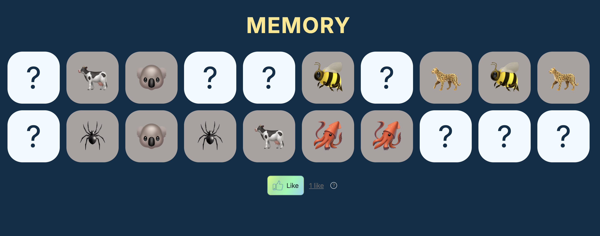
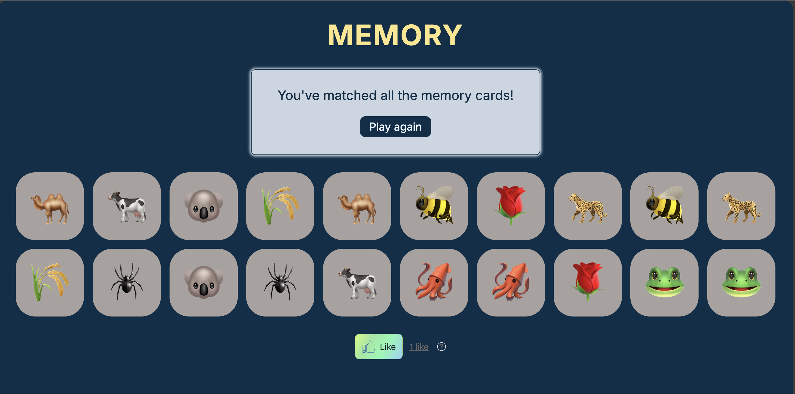
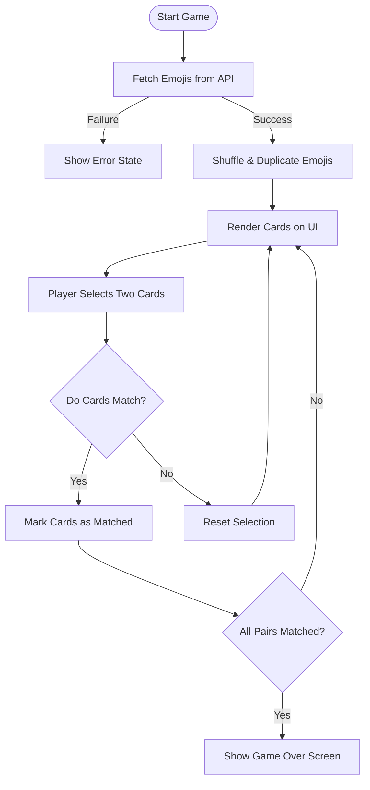

<h1 align="center" id="title">Memory game</h1>
<br>

A Fully accessible, interactive memory card matching game built with React. Test your memory by matching pairs of emojis across different categories!

The app allows users to select an emoji category and the number of cards, then play a classic memory matching game.


The goal of this project is to practice deploying a modern React application using Docker and GitHub Actions.


Visit the [Memory Game on GitHub Pages](https://gmarav05.github.io/memory-game/).

## Video


## Image

 </br>
 </br>


## 🎯 How to Play

1. **Select Your Preferences**
   - Choose an emoji category (Animals, Food, Travel, Objects, or Symbols).
   - Select the number of cards (10 to 50).

2. **Start the Game**
   - Click "Start Game" to begin.
   - All cards will be face down.

3. **Match the Pairs**
   - Click on any card to reveal the emoji.
   - Click on a second card to find its match.
   - If they match, they stay revealed.
   - If they don't match, they flip back over.

4. **Win the Game**
   - Continue matching pairs until all cards are revealed.
   - The game celebrates your victory! 🎉.

5. **Play Again**
   - Click "Play Again" to start a new game with different emojis.

## 🌟 Features

### Core Gameplay
- **Multiple Categories**: Choose from 5 different emoji categories:

  - Animals and Nature 🦁

  - Food and Drink 🍕

  - Travel and Places ✈️

  - Objects 🎨

  - Symbols 🔣

- **Adjust Difficulty**: Select from 10 to 50 cards.

- **Real-time Matching**: Instant visual feedback for card selection and matches.

- **Smooth Animations**: Card flip animations for an engaging user experience.

- **Game Completion Detection**: Celebrates when all pairs are matched.

### Accessibility Features

- **Full ARIA Support**: Comprehensive screen reader compatibility.

- **Live Regions**: Real-time game status updates for assistive technologies.

- **Keyboard Navigation**: Complete keyboard accessibility.

- **Focus Management**: Automatically handles focus for better UX.

- **Semantic HTML**: Follows semantic heading structure and landmarks for screen readers.

### Technical Features

- **API Integration**: Dynamic emoji data from EmojiHub API.

- **Error Handling**: Implemented Graceful error management with user-friendly messages.

- **Responsive Design**: Mobile-first, works on all screen sizes.

- **Modern UI**: Clean, minimalist interface with CSS animations.


### Social Integration

- **Nostr Integration**: Like button powered by Nostr protocol.

- **Custom Styling**: Beautifully styled Nostr component with gradient effects.


## 🧠 Game Logic Flow




## 💻 Technology Stack

| Category | Technologies |
|----------|-------------|
| **Frontend** | React 19, HTML5, CSS3 |
| **Build Tool** | Vite 7.2.4 |
| **Deployment** | GitHub Actions, GitHub Pages |
| **Containerization** | Docker (Node.js 22 Alpine) |
| **API** | EmojiHub REST API |
| **Dependencies** | nostr-components, html-entities |


## Learnings

### React Concepts
1. **State Management**: Complex state interactions with `useState` for game logic.

2. **Effect Hooks**: `useEffect` for side effects like match detection and game completion.

3. **Ref Hooks**: `useRef` for focus management and DOM manipulation.

4. **Component Composition**: Building reusable, modular components.

5. **Props Drilling**: Efficient data flow through component hierarchy.

6. **Conditional Rendering**: Dynamic UI based on game state.

### JavaScript Skills
1. **Async/Await**: API data fetching with proper error handling.

2. **Array Methods**: Advanced use of `map`, `reduce`, `filter`, and `find`.

3. **Fisher-Yates Shuffle**: Implementing proper randomization algorithm.

4. **Random Selection**: Generating unique random indices without duplicates.


### Accessibility (A11y)

1. **ARIA Attributes**: Proper use of `aria-live`, `aria-label`, `aria-atomic`.

2. **Screen Reader Support**: Comprehensive assistive technology compatibility.

3. **Focus Management**: Programmatic focus control for better UX.


### Tooling
1. **Vite**: Modern build tool configuration and optimization.

2. **GitHub Actions**: CI/CD pipeline for automated deployment.

3. **GitHub Pages**: Static site deployment with custom base path.

4. **Docker**: Containerization for consistent development environments.


### Best Practices

1. **Error Boundaries**: Graceful error handling and user feedback.

2. **Loading States**: User-friendly loading and error states.

3. **Code Organization**: Clean file structure and separation of concerns.

4. **DRY Principle**: Reusable components and utility functions.

5. **Git Workflow**: Proper version control and deployment process.


## Live demo

Visit the [Memory Game on GitHub Pages](https://gmarav05.github.io/memory-game/).


### API Integration
- **Error Handling**: Try-catch blocks with user-friendly error messages.

- **Data Processing**: Slicing, pairing, and shuffling API responses.

- **Dynamic Categories**: Fetches emojis based on user-selected category.

### Deployment Pipeline

- **Automated CI/CD**: GitHub Actions workflow for testing and deployment.

- **Build Optimization**: Vite's production build with code splitting.

- **Path Configuration**: Proper base path setup for GitHub Pages subdirectory.


## Project Structure
```
memory-game/

├── src/
│   ├── components/
│   │   ├── App.jsx              # Main app component
│   │   ├── Form.jsx             # Game setup form
│   │   ├── MemoryCard.jsx       # Card container
│   │   ├── EmojiButton.jsx      # Individual card button
│   │   ├── GameOver.jsx         # Victory screen
│   │   ├── ErrorCard.jsx        # Error display
│   │   ├── AssistiveTechInfo.jsx # Screen reader info
│   │   ├── Select.jsx           # Form select component
│   │   ├── Option.jsx           # Select options
│   │   └── RegularButton.jsx    # Reusable button
│   ├── data/
│   │   └── data.js              # Game configuration data
│   └── index.jsx                # React entry point
├── .dockerignore                # Docker ignore rules
├── .github/
│   └── workflows/
│       └── node.js.yml          # CI/CD workflow
├── Dockerfile                   # Docker configuration
├── index.html                   # HTML entry point
├── index.css                    # Global styles
├── vite.config.js               # Vite configuration
└── package.json                 # Project dependencies
```


# Installation & Setup

## Prerequisites

- Node.js (v20.19.0+ or v22.12.0+)
- npm (v8.0.0+)


## 🖥️ Local Development

```bash
# Clone the repository
git clone https://github.com/gmarav005/memory-game.git
cd memory-game

# Install dependencies
npm install

# Start development server
npm run dev
```

The game will be available at **http://localhost:5173**

## 🐳 Docker Setup

```bash
# Build the Docker image
docker build -t memory-game .

# Run the container
docker run -p 5173:5173 memory-game
```

Access the game at **http://localhost:5173**

### 📜 Available Scripts

| Command | Description |
|---------|-------------|
| `npm run dev` | Start development server with hot reload |
| `npm run build` | Build optimized production bundle |
| `npm run preview` | Preview production build locally |
| `npm run lint` | Run ESLint for code quality checks |
| `npm run deploy` | Deploy to GitHub Pages |
| `npm test` | Run tests (placeholder for future tests) |

---

## 🐳 Docker Configuration

The project includes a Dockerfile for containerized development:

- Uses Node.js 22 Alpine for minimal image size.

- Exposes port 5173 for development server.

- Includes `.dockerignore` to exclude unnecessary files.

## 🚢 Deployment

The project uses GitHub Actions for automated deployment:

1. Pushes to `main` branch trigger the CI/CD pipeline.

2. Runs tests (currently placeholder).

3. Builds the production bundle.

4. Deploys to GitHub Pages automatically.

## 🙏 Acknowledgments

- [EmojiHub API](https://github.com/cheatsnake/emojihub) for emoji data.

- [Nostr Components](https://www.npmjs.com/package/nostr-components) for social integration.

 
# Final Notes

- The project demonstrates best practices in React, accessibility, containerization, and CI/CD.
- The code is modular, easy to extend, and open for contributions.

---

> **Accessibility Focus*:*
> Every part of the UI is accessible by keyboard and provides live updates for screen readers.

---


<div align="center">

### 💡 Key Learnings

| Feature | Description |
|---------|-------------|
| ♿ **Accessibility First** | Every UI element is keyboard accessible with screen reader support |
| 🐳 **Docker Ready** | Containerized for consistent development across environments |
| 🚀 **Auto Deploy** | CI/CD pipeline automatically deploys on every push |
| 🎨 **Modern Stack** | Built with React 19, Vite, and modern web standards |

---

**Made with ❤️ and React** | **Deployed with GitHub Actions** | **Powered by EmojiHub API**

Enjoy your game! 🧠🎉

</div>
